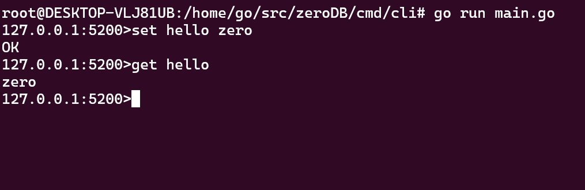

zeroDB 是一个稳定、高性能、快速、内嵌的 k-v 数据库，支持多种数据结构，包含 `String`、`List`、`Hash`、`Set`、`Sorted Set`，接口名称风格和 Redis 类似。

zeroDB 基于简单的 bitcask 模型，数据文件布局类似 LSM Tree 中的 WAL 日志，纯 `Golang` 实现，易于理解和使用。

## 特性

* 支持丰富的数据结构：字符串、列表、哈希表、集合、有序集合。
* 内嵌使用简单至极，无需任何安装部署。
* 低延迟、高吞吐。
* 不同数据类型的操作可以完全并行。
* 支持客户端命令行操作。
* 支持过期时间。
* `String` 数据类型支持前缀和范围扫描。
* 支持简单的事务操作，ACID 特性。

## 介绍

一个 zeroDB 实例，其实就是系统上的一个文件夹，在这个文件夹中，除了一些配置外，最主要的便是数据文件。一个实例中，只会存在一个活跃的数据文件进行写操作，如果这个文件的大小达到了设置的上限，那么这个文件会被关闭，然后创建一个新的活跃文件。

其余的文件，称之为已归档文件，这些文件都是已经被关闭，不能在上面进行写操作，但是可以进行读操作。

所以整个数据库实例就是当前活跃文件、已归档文件和其他配置的一个集合：

在每一个文件中，写数据的操作只会追加到文件的末尾，这保证了写操作不会进行额外的磁盘寻址。写入的数据是以一个个被称为 Entry 的结构组织起来的，Entry 的主要数据结构如下：

因此一个数据文件可以看做是多个 Entry 的集合：

所有的写入、删除、更新操作，都会被封装成一个 Entry，追加到数据文件的末尾。一个 key 可能会被多次更新，或者被删除，因此数据文件当中可能存在冗余的 Entry 数据。在这种情况下，我们需要合并数据文件，来清除冗余的 Entry 数据，回收磁盘空间。

## 使用

### 命令行操作

切换目录到 `zeroDB/cmd/server`

运行 server 目录下的 `main.go`

打开一个新的窗口，切换目录到 `zeroDB/cmd/cli`

运行目录下的 `main.go`

